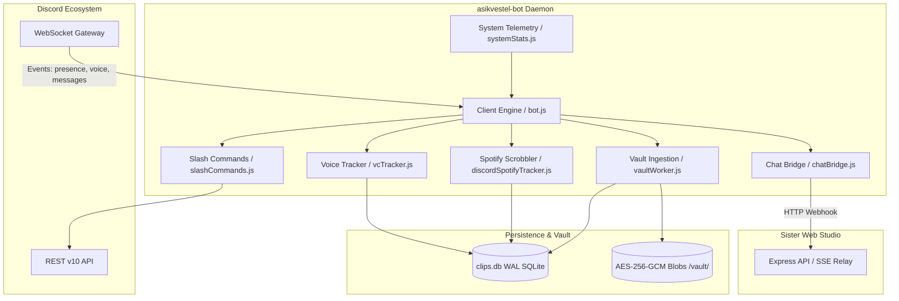

# System Architecture

> Sources: [`src/index.js:1-45`](file:///home/barb/gemini/asikvestel-bot/src/index.js), [`src/bot.js:1-250`](file:///home/barb/gemini/asikvestel-bot/src/bot.js), [`src/vaultWorker.js:1-180`](file:///home/barb/gemini/asikvestel-bot/src/vaultWorker.js), [`src/vaultStorage.js:1-160`](file:///home/barb/gemini/asikvestel-bot/src/vaultStorage.js), [`src/db.js:1-300`](file:///home/barb/gemini/asikvestel-bot/src/db.js)

## 1 System Overview

`asikvestel-bot` is a standalone daemon built with Node.js and Discord.js v14. It connects to the Discord Gateway via WebSockets, ingests community media into an AES-256-GCM encrypted local vault, tracks music streaming and voice activity, and bridges Discord channels with the external web studio.



## 2 Architectural Layer Hierarchy

The codebase is strictly organized into 5 layers. Lower layers must never depend on or import from higher layers.

```
Layer 4: Entry Point (src/index.js)
   └── Layer 3: Bot Integrations & Scanners (src/bot.js, src/slashCommands.js, ...)
        └── Layer 2: Domain Services & Tracking (src/vaultWorker.js, src/vcTracker.js, ...)
             └── Layer 1: Persistence & Parsing (src/db.js, src/vaultStorage.js, src/parser.js)
                  └── Layer 0: Foundation & Config (src/config.js, src/crypto.js, ...)
```

### 2.1 Layer 0: Foundation & Config
- **[`src/config.js`](file:///home/barb/gemini/asikvestel-bot/src/config.js)**: Reads and validates environment variables.
- **[`src/crypto.js`](file:///home/barb/gemini/asikvestel-bot/src/crypto.js)**: AES-256-GCM cipher helper, IV generation, authentication tag handling.
- **[`src/dynamicDataDefaults.js`](file:///home/barb/gemini/asikvestel-bot/src/dynamicDataDefaults.js)**: Initial seed data for quotes, lore, rules, and game tags.

### 2.2 Layer 1: Persistence & Storage
- **[`src/db.js`](file:///home/barb/gemini/asikvestel-bot/src/db.js)**: `better-sqlite3` driver with prepared statements, WAL pragma, and transaction batching.
- **[`src/vaultStorage.js`](file:///home/barb/gemini/asikvestel-bot/src/vaultStorage.js)**: File-based encrypted blob storage with SHA-256 path hashing and traversal prevention.
- **[`src/parser.js`](file:///home/barb/gemini/asikvestel-bot/src/parser.js)**: Regular expressions for game detection, emoji extraction, and media URL parsing.

### 2.3 Layer 2: Domain Services & Telemetry
- **[`src/vaultWorker.js`](file:///home/barb/gemini/asikvestel-bot/src/vaultWorker.js)**: Media fetcher with SSRF filters, size constraints, and database record upserts.
- **[`src/discordSpotifyTracker.js`](file:///home/barb/gemini/asikvestel-bot/src/discordSpotifyTracker.js)**: Real-time user presence observer tracking track changes and scrobbling plays >= 30 seconds.
- **[`src/vcTracker.js`](file:///home/barb/gemini/asikvestel-bot/src/vcTracker.js)**: In-memory voice duration tracker with periodic and shutdown flushes.
- **[`src/systemStats.js`](file:///home/barb/gemini/asikvestel-bot/src/systemStats.js)**: Telemetry collector querying OS resources, PM2 status, and remote server latency.
- **[`src/chatBridge.js`](file:///home/barb/gemini/asikvestel-bot/src/chatBridge.js)**: HTTP relay forwarding channel messages to the sister website's internal SSE bridge.
- **[`src/botEmbeds.js`](file:///home/barb/gemini/asikvestel-bot/src/botEmbeds.js)**: Discord embed and ActionRow UI button builders.

### 2.4 Layer 3: Bot Integrations & Scanners
- **[`src/bot.js`](file:///home/barb/gemini/asikvestel-bot/src/bot.js)**: Gateway client setup, partials, intents, message routing, and event subscriptions.
- **[`src/slashCommands.js`](file:///home/barb/gemini/asikvestel-bot/src/slashCommands.js)**: Slash command registration via `@discordjs/rest` and execution router.
- **[`src/backfill.js`](file:///home/barb/gemini/asikvestel-bot/src/backfill.js)**: Historical channel backfill with rate limit throttling.
- **[`src/scanNewServer.js`](file:///home/barb/gemini/asikvestel-bot/src/scanNewServer.js)** & **[`src/scanMediaAndGifs.js`](file:///home/barb/gemini/asikvestel-bot/src/scanMediaAndGifs.js)**: Bulk channel scanners.

### 2.5 Layer 4: Entry Point
- **[`src/index.js`](file:///home/barb/gemini/asikvestel-bot/src/index.js)**: Bootstraps the application, registers SIGINT/SIGTERM handlers, and orchestrates clean shutdown.

## 3 Core Pipelines

### 3.1 Media & Vault Pipeline
1. Message detected in monitored channels (`CLIPS_CHANNEL_IDS`, `MEDIA_SCAN_CHANNEL_IDS`).
2. `parser.extractMedia()` identifies video attachments, YouTube links, Tenor GIFs, or Klipy URLs.
3. `vaultWorker.js` validates URL (SSRF check against private IPs / metadata endpoints).
4. Media stream is piped through AES-256-GCM cipher using a derived key from `VAULT_SECRET_KEY`.
5. Encrypted blob written to `/var/lib/asikvestel/vault/<hash>`.
6. Metadata record upserted into `clips` or `images` table in SQLite.

### 3.2 Spotify Presence Scrobbler
1. Discord Gateway emits `presenceUpdate` event.
2. `discordSpotifyTracker.parseSpotifyPresence()` extracts track name, artist, album, and start/end timestamps.
3. If user switches tracks or stops, elapsed playback is evaluated.
4. If elapsed duration >= 30 seconds, record is inserted into `spotify_history`.

## 4 Cryptography & Storage

- **Database**: SQLite 3 located at `DB_PATH` (`/var/lib/asikvestel/clips.db`). Uses `journal_mode = WAL` to allow simultaneous reads by the web studio without write lock contention.
- **Vault Encryption**: AES-256-GCM with 96-bit random IVs and 128-bit authentication tags. Prevents unauthorized disk access and detects blob corruption/tampering.

## 5 Daemon Lifecycle & Safety

- **Graceful Termination**: On `SIGTERM` / `SIGINT`, `index.js` triggers `vcTracker.flushActiveVoiceSessions()`, persists buffered user records, and closes database connections cleanly before exiting.
